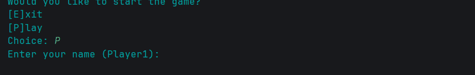
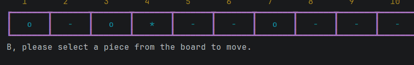
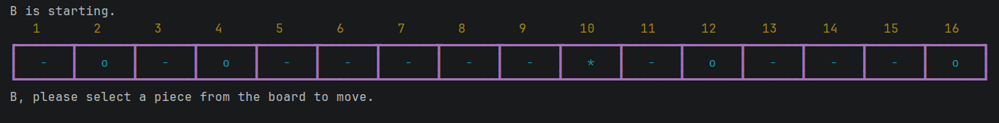

# Results of Testing

The test results show the actual outcome of the testing, following the [Test Plan](test-plan.md)

---

## User choice, exit or play game. - VALID

I will choose whether to play or exit.

### Test Data To Use

I will enter the expected characters P (Play) or E (Exit).

### Test Result

Test passed - the letters P for play continued to the next step in the game and E exited.
---

## User choice, exit or play game. - INVALID

I will enter incorrect inputs to ensure that they are rejected, the user will be prompted to enter the correct input until they do.

### Test Data To Use

Entering random characters.
Entering nothing.

### Test Result

Test passed - The invalid inputs were rejected.

---

## Username input - VALID

I will enter a username that follow the parameters set in the code.

### Test Data To Use

Entering a username within 13 characters and not blank.
I will do this for player 1 and player 2.

### Test Result

Test passed - The usernames that I entered under the character limit was accepted.

---

## Username input - INVALID

I will enter a username that is over the 13-character limit.

### Test Data To Use

Entering a username over 13 characters and not blank.
I will do this for player 1 and player 2.

### Test Result

Test passed - The over 13 character limit usernames were rejected for both players.

---

## Username input - INVALID

I will enter a username that blank.

### Test Data To Use

Entering a username that is blank.
I will do this for player 1 and player 2.

### Test Result

Test passed - The blanks spaces were rejected.

---

## Username input - BOUNDARY

I will enter a username that is on the 13-character limit.

### Test Data To Use

Entering a username on the 13-character limit and not blank.
I will do this for player 1 and player 2.

### Test Result

Test passed - The 13 character usernames were accepted.

---

## Username input - Boundary

I will enter a username that is on the 1 character minimum.

### Test Data To Use

Entering a username 1 character in length.
I will do this for player 1 and player 2.

### Test Result

Test passed - The 1 character usernames were accepted.

---

## Username input - INVALID

I will enter a username that is over the 13-character limit.

### Test Data To Use

Entering a username over 13 characters and not blank.
I will do this for player 1 and player 2.

### Test Result

Test passed - The usernames over 13 characters were rejected.

---

## Username input - INVALID

I will enter a username that is blank.

### Test Data To Use

Entering a username that is blank.
I will do this for player 1 and player 2.

### Test Result

Test passed - The usernames over 13 characters were rejected.

---

## Gameplay: Player Piece Movement - VALID

I will move a piece without breaking any rules.

### Test Data To Use

From a cell that has a piece in it, to the left to a cell that is blank/unoccupied.
I will do this for player 1 and player 2.

### Test Result

Test passed - The movement of the piece 3 to 2 on B's turn worked. The movement of player A, 4 to 3 worked as well.

---

## Gameplay: Player Piece Movement - INVALID

I will move a piece to the right.

### Test Data To Use

From a cell that has a piece in it, to the right to a cell.
I will do this for player 1 and player 2.

### Test Result

Test passed - The movement on both player A and B's turn was rejected as they tried moving to the right.

---

## Gameplay: Player Piece Movement - INVALID

I will move a piece into a cell that is occupied by another piece.

### Test Data To Use

From a cell that has a piece in it, to a cell occupied.
I will do this for player 1 and player 2.

### Test Result

Test passed - The movement of the piece 3 to 2 on B's turn worked. The movement of player A, 4 to 3 worked as well.

---
